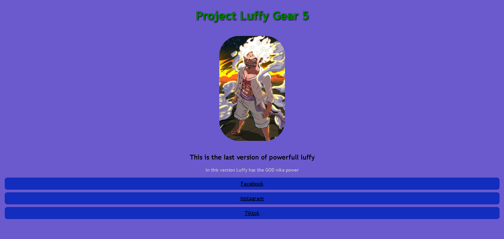

# Primer HTML - Luffy G5

A clean and minimalist web layout built to practice the fundamental building blocks of web development. This project focuses on mastering the box model, spacing, and basic styling concepts.

## 🚀 Overview

This project was developed as a hands-on exercise to strengthen my understanding of HTML5 and CSS3 basics. It specifically explores:
*   **HTML5 Semantic Tags:** Proper document structuring.
*   **The Box Model:** Detailed use of `margin`, `border`, and `padding`.
*   **CSS Styling:** Working with colors, typography, and basic element positioning without relying on advanced frameworks or layouts like Flexbox/Grid.

## 🛠️ Built With

*   **HTML5:** Structure and content.
*   **CSS3:** Styling, borders, and spacing.

## 🖼️ Preview

<!-- Make sure the file name in /assets/ matches your actual file name -->

## 📖 What I Learned

During this project, I focused on:
1. Understanding how elements occupy space in the document flow.
2. Managing internal spacing (`padding`) versus external spacing (`margin`).
3. Using borders to define visual hierarchy.

## 🏁 Getting Started

To view this project
[CLICK HERE]( https://josuevasquez2305.github.io/primer-html-luffy/)
